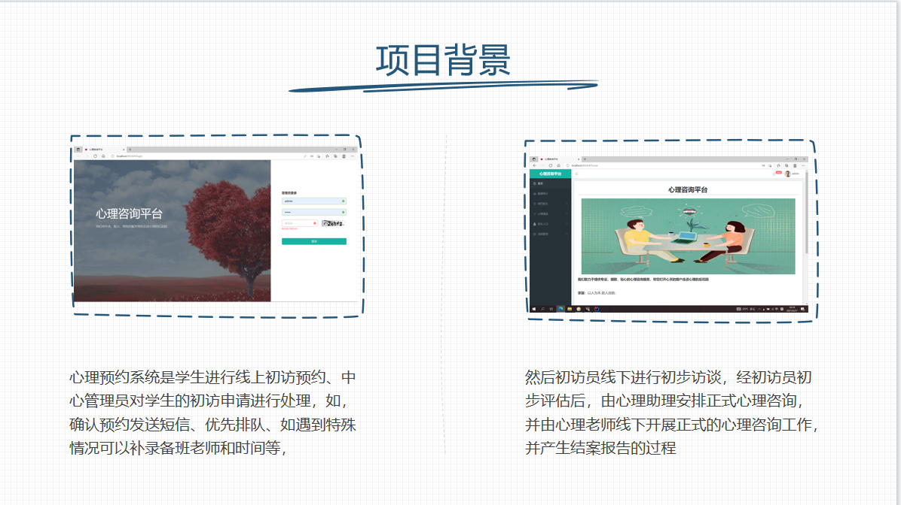
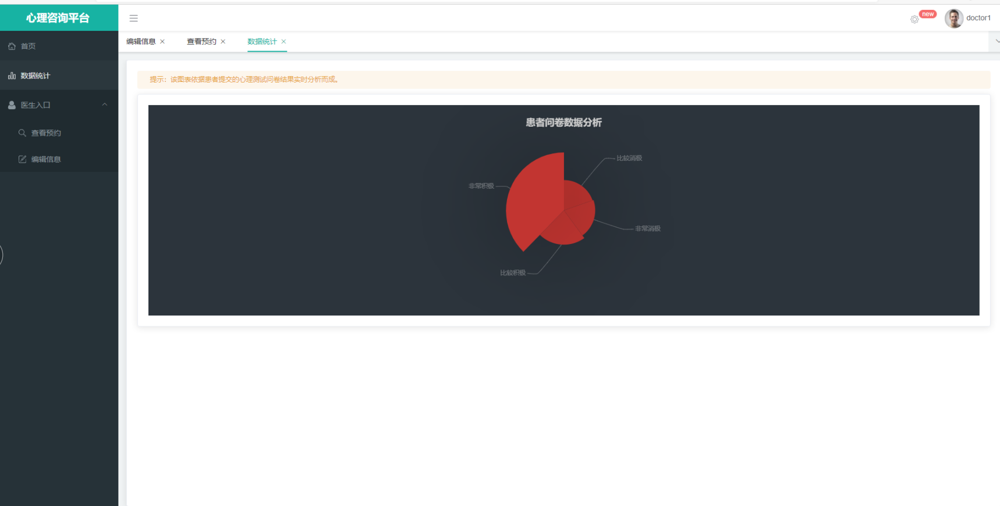
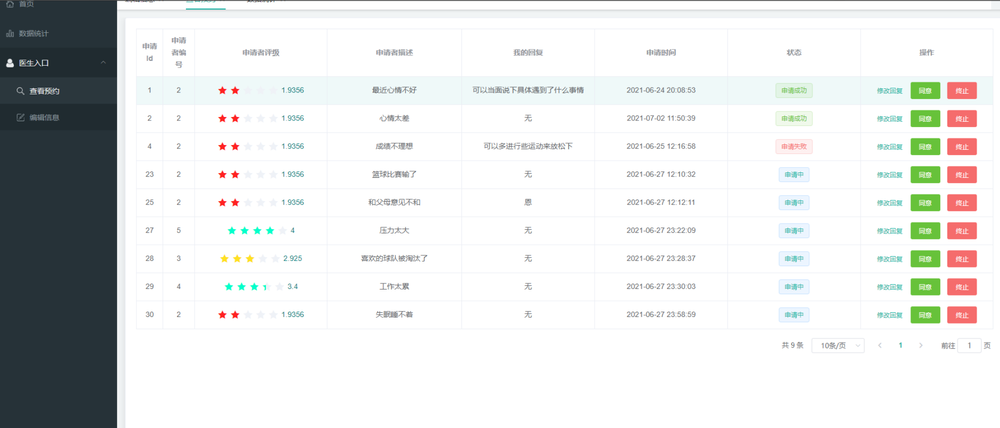

# Psychological Consult

心理咨询项目，包含心理咨询和心理测试两个大模块，前后端都在这一个库

**前后端分离**

- 前端vue+elementUI
- 后端springboot+mybatisPlus+shiro

## 项目部署

- maven导依赖
- 启动后端
- 启动前端

## 角色 - 登录账号密码

- 超级用户:admin admin
- 普通管理员：admin 123
- 心理医生：doctor1 123
- 咨询者：client1 123

本项目使用[人人开源 (gitee.com)](https://gitee.com/renrenio)进行的二次开发

